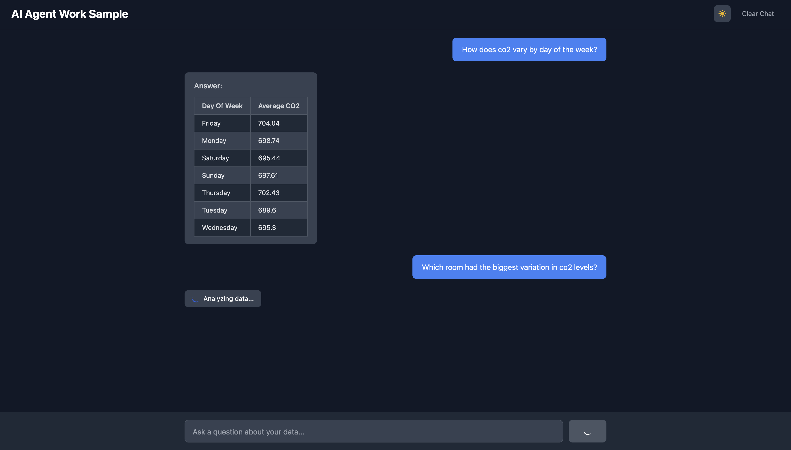
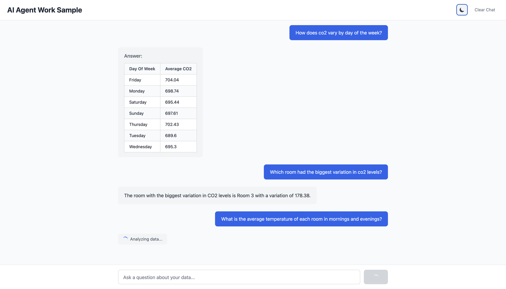
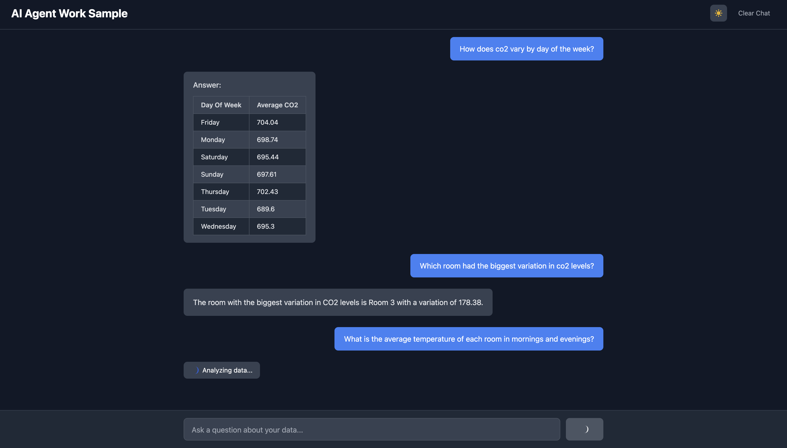
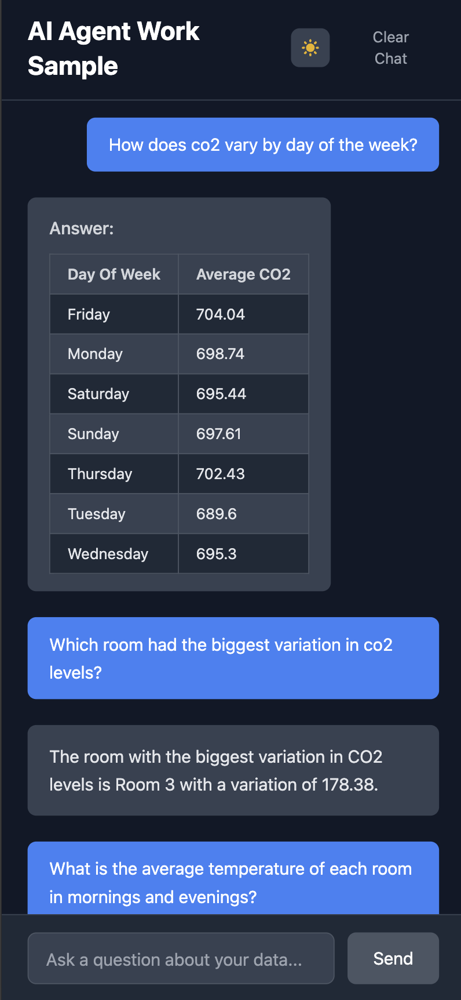

# Air Quality Data Analysis Assistant

An AI-powered assistant that analyzes air quality datasets from multiple rooms, generating Python code dynamically to answer user queries with timezone-aware, cleanly formatted results. Built with FastAPI, OpenAI GPT, and Pandas.

---

## Features

- Load and normalize air quality data from `.ndjson` files.
- Dynamic Python code generation using OpenAI's GPT-4o-mini model.
- Robust handling of timezone-aware timestamps and pandas best practices.
- Clear, human-readable output with proper formatting and rounding.
- Supports light mode and dark mode UI themes.
- Responsive design for seamless experience on mobile devices.
- Loading screen to indicate data fetching and processing status.

---

## Demo Screenshots

### Loading Screen  

### Light Mode  

### Dark Mode  

### Mobile Responsiveness  

---
